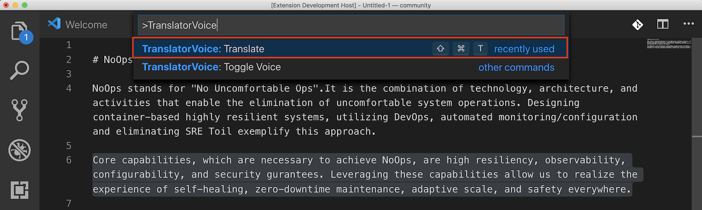
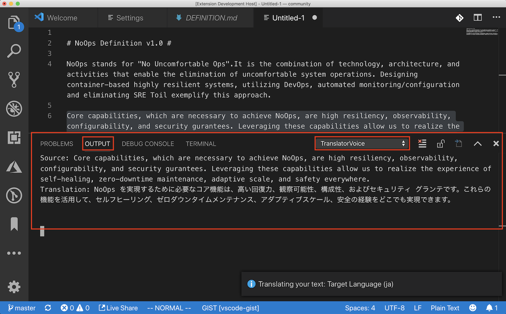
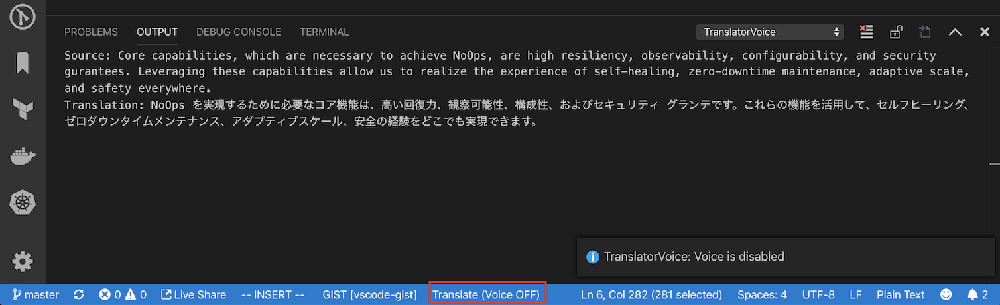
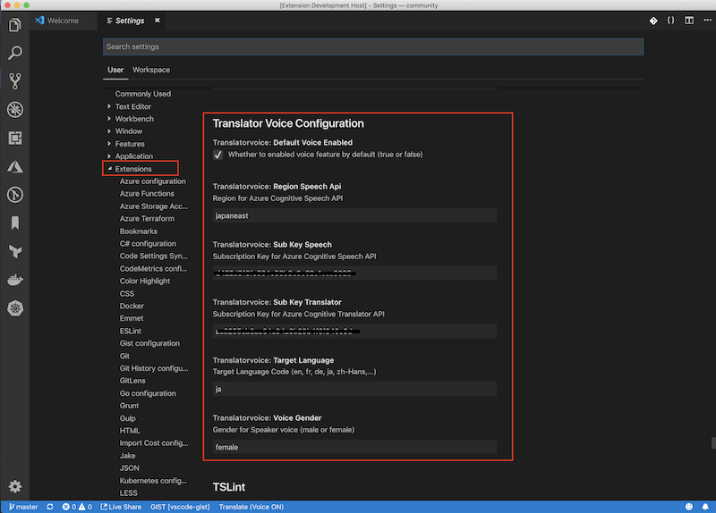

# vscode-translator-voice

VSCode Extension for Text Translation and TTS (text-to-speech) using [Azure Cognitive Services](https://azure.microsoft.com/en-us/services/cognitive-services/). 

> **Very Important** - In order to use this extension you must have a Azure Cognitive Services account with Translator Text and Speech Service resources. If you don't have it already, get one [here](https://docs.microsoft.com/en-us/azure/cognitive-services/cognitive-services-apis-create-account)

## Features

- **Text Translation** (using V3 Translator API of Azure Cognitive Services)
- **Text-to-speech** (using TTS API of Azure Cognitive Services)
- **Multi-Language support** (See [this](https://docs.microsoft.com/en-us/azure/cognitive-services/translator/language-support#translation) for the detail)

## Requirements

You must have an `Azure Cognitive Services account` with a `Translator Text` and a `Speech Services` resources.
If you don't have an account, please create:
- [Create a Cognitive Services account](https://docs.microsoft.com/en-us/azure/cognitive-services/cognitive-services-apis-create-account)

## Usage
#### Configure Extension Settings
Please see [Extension Settings](#extension-settings)

#### Select target text in your editor to translate 
You need to select target text in your editor to translate. Without it, you can not execute the command.

#### Execute "TranslatorVoice: Translate" command
Execute `TranslatorVoice: Translate` command from command palette like this:

You can exectue the command with a shortcut key:`CTL + Shift + T` (Mac:`Cmd + Shift + T`) as well.

Then, translated text will be added to Output window like this:
 

#### Disable/Enable Voice feature
You can disable/enable Voice feature by (1) executing `TranslatorVoice: Toggle Voice` command from command palette, or (2) clicking statusBarItem named `Translate (Voice ON)` like this:

By toggling the statusBarItem, you can enable/disable the Voice.

## Extension Settings

Configure the extension settings through the `contributes.configuration` extension point.

The extension contributes the following settings:

* `translatorvoice.subKeyTranslator`: Subscription Key for Cognitive Translator API
* `translatorvoice.subKeySpeech`: Subscription Key for Cognitive Speech API
* `translatorvoice.regionSpeechApi` : Region for Cognitive Speech API (ex, japaneast, eastus, ...). Please refer to [this page](https://docs.microsoft.com/en-us/azure/cognitive-services/speech-service/rest-text-to-speech) for the detail of available region for the API
* `translatorvoice.defaultTargetLanguage`: Target Language Code (en, fr, de, ja, zh-Hans,...). Please refer to [this page](https://docs.microsoft.com/en-us/azure/cognitive-services/translator/language-support#translation) for the detail of supported language code. 
* `translatorvoice.defaultVoiceEnabled`: Whether to enabled voice capability by default: true|false
* `translatorvoice.defaultVoiceGender`: Default Gender for speaker (male|female)

Please go to `Settings` and choose `Translator Voice Configuration` in `Extensions` group in User settings, and update the settings options above.

## Change Log
See [Change Log](CHANGELOG.md)

## Contributing

Bug reports and pull requests are welcome on GitHub at https://github.com/yokawasa/vscode-translator-voice